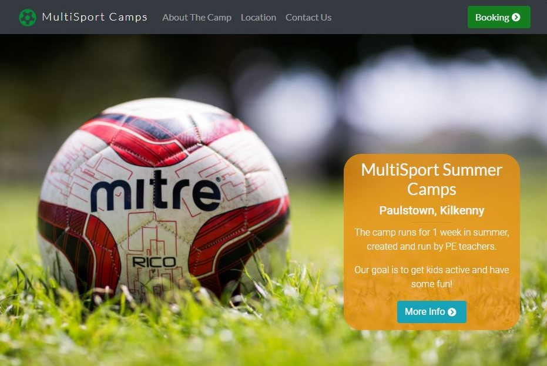

# MultiSport Summer Camps

This is a static website built mainly with HTML5, CSS3 & Bootstrap. It was made for my first project with the Code Institute in Dublin.

The website for a group of teachers to promote their sport summers camps and allow users to make bookings online.
There are pages for information about the camp, the location and contact and booking areas.

 
## UX
 
I wanted to focus on a website that wasn't confusing to users and they could easily navigate and do what they need to do.
It provides information on the camp, areas to book a place and contact the organisers.

- As a user of the site:
    * I want to find out information about the camps.
    * I want to easily navigate the site through intuitive calls to action.
    * I want the information I need to be where it is expected.
    * I want to contact the orgaisers of the camp easily. 
    * I want to book a place on a camp easily.

Here is a pdf of the wireframes I did before starting my project:
 
 * [Wireframes](wireframes/project-1-wireframes.pdf)

They have changed a bit from the original design based on my conversations with the organisers of the camp after sending a version of the site to them.

## Features

### Existing Features
- Landing Index Page - allows users to navigate through the site and provides a snapshot of the different information contained on it.
- About Page - Gives more detailed information to users such as the price of the camp and times it is on.
- Location Page - Shows the exact location of the camp on Google Maps which can easily be opened in their app.

### Features Left to Implement
#### Contact Form
* At the moment, the contact form does nothing.
In the future, I hope to add an email API to the contact form so the user can actually send an email to the camp provider.
APIs are out of the scope of this project and I'm also waiting on confirmation from the provider.

#### Booking Form
* Same goes for the booking form.
I hope to connect a payment provider such as Stripe to this and allow users to make booking, where then a confirmation email will be sent to both user & provider.

#### Content of the website
* I don't have some of the information for the camps yet.
Content such as phone numbers and email addresses I have filled with placeholder text.

## Technologies Used

* HTML5 & CSS3
* [Bootstrap](https://getbootstrap.com/)
    * This project uses **Bootstrap** to simplify the responsiveness of the website for mobile devices
* [Font Awesome](https://fontawesome.com/)
    * This projects makes use of **Font Awesome** for displaying eye-catching icons throughout the site.
* [Hover.css](https://ianlunn.github.io/Hover/)
    * This project uses **Hover.css** to make the buttons used more interactive.

## Testing

- Since there is no functionality on the back end of this website yet, most of the testing was done on the design and responsiveness of the website.

- I have tested its responsiveness on all devices and everything looks good. I have also shown the site to the organisers to allow them to test all areas of the site.

- Although there is no functionality yet, I tested the contact and booking forms to ensure the required values were needed. In the future, I will need to test that the forms behave as expected and have no bugs.

Initally there, were a lot of bugs in the responsiveness. 
Things that may have looked good on a desktop and mobile
site, may not have looked good on a landscape iPad for 
example. I was rigourous in my use of Bootstrap and CSS 
to ensure the site looked good, with a lot of help from
using media queries and Bootstrap classes.

## Deployment

This section should describe the process you went through to deploy the project to a hosting platform (e.g. GitHub Pages or Heroku).

In particular, you should provide all details of the differences between the deployed version and the development version, if any, including:
- Different values for environment variables (Heroku Config Vars)?
- Different configuration files?
- Separate git branch?

In addition, if it is not obvious, you should also describe how to run your code locally.

## Credits

### Media
- The photos used in this site were obtained from [pexels.com](https://www.pexels.com/).

### Acknowledgements

- I'd like to thank my mentor Gurjot Singh for all the help and advice during the development of the website